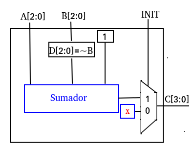

# lab01 : Unidad de suma, resta, multiplicación, división y visualización BCD

Integrantes


* Jose Alvaro Celis

* Julian David Pulido Castañeda

* Julian Escobar Jamioy

* Esteban Ladino Fajardo


## Introducción

Con el objetivo de incursionar en el mundo de los procesadores, se plantea la implementación de una *alu* con tres operaciones básicas: suma, resta y multiplicación. Cada operación se activa con un *opecode* específico y el resultado correspondiente se visualiza en un display de 7 segmentos de la targeta de desarrollo *nexys A7*. El módulo a diseñar completamente es el restador, los restantes solo se deben modificar. 


## Descripción de módulos

A continuación se describen los trés módulo que componen la alu.

### Módulo sumador

### Módulo restador

Su diagrama estructural es:





La descripción de hardware del módulo restador está localizada en ./alu/alu.srcs/sources_1/new/restador.v. Se optó por dejarlo parametrizado y las entradas son el *clk* (que no se utilizó), el minuendo *A*, es sustraendo *B* y la diferencia *C* que es de 1 bit más que sus demás operadores. La entrada *INIT* permite indicar en qué momento que realiza la operación. A continuación se encuentra la descripción de harware en verilog.


``` verilog
module restador#(
parameter n=2
)
(
    
    clk,
    A,
    B,
    INIT,
    C
    );
    
    
    input clk;
    input [n:0]A;
    input [n:0]B;
    input INIT;
    
    output reg[n+1:0] C;

```
Para realizar la resta se utilizó el complemento a dos lo cual indica que cuando el bit más significatico es cero, el resultado es negativo y en el caso contrario es positivo. El `reg [n:0]D` fue necesario ya que al negar *B* directamente en la misma linea donde se suma complemento a dos de *B* y *A*, B se negaba como si fuera de 4 bit y por definición del complemento a dos se necesitaba que se tuviera en cuenta la operación con la negación de 3 bits. Esto causó resultados inesperados durante largo tiempo y a continuación se presenta la descripción de Hardware final.
```verilog
    reg [n:0] D;
    
always@(*) begin
    
    D=~B;
    
    if(INIT) C=A+D+1;
    
    end
    
endmodule

```

### Módulo de Multiplicación

## Simulación

El archivo de simulación se puede encontrar en ./alu/alu.srcs/sim_1/imports/alu/testbench.v. Al comienzo se declaran los registros y wires necesarios para realizar la instanciación del módulo top *alu.v*. A continuación se muestra:

```verilog

	// Inputs
	reg [2:0] portA;
	reg [2:0] portB;
	reg [1:0] opcode;
	reg clk;
	reg rst;

	// Outputs
	wire [0:6] sseg;
	wire an;
	
	// senales de prueba
	
	//wire [3:0] int_bcd;

	// Instantiate the Unit Under Test (UUT)
	alu uut (
		.portA(portA), 
		.portB(portB), 
		.opcode(opcode), 
		.sseg(sseg), 
		.an(an), 
		.clk(clk), 
		.rst(rst)
    // senales de prueba
        //.int_bcd(int_bcd)		
		
	);
```

La salida `int_bcd` se utilizó como señal de prueba para saber si el resultado de cada operación realizada en el `alu.v` era el indicado.

Para realizar la simulación de manera automática, se opta por realizar un for de tal manera que las entradas portA y portB tengan todas las combinaciones, mientras que el `opcode` también varia utilizando las diferentes operaciones. Esto se puede apreciar en las siguiente descripción de hardware:

```verilog

	initial begin
		// Initialize Inputs
		opcode = 0;
		clk = 0;
		rst = 1;
		portA=0;
		portB=0;
	
	
    
		
		// Wait 100 ns for global reset to finish
		#10;
        
		rst = 0;
		// Add stimulus here
		
		for(portB=0;portB<8;portB=portB+1) begin
		
		  if(portB==7) portA=portA+1; 
		
            #50 opcode =opcode+ 1;
            #50 opcode =opcode+ 1;
            #50 opcode =opcode+ 1;
            #50 opcode=opcode+ 1;
         end

         end
   
	always #1 clk = ~clk;

```

En este caso, se espera que `portB` varie desde 0 hasta 111 mientras que `portA` se aumenta en 1 de forma gradual cada vez que `portB` llega al máximo valor. La estructura del for hace que sea un ciclo limitado por el tiempo de simulación, debido a que `portB` no puede ser mayor o igual a 8 . Además #x, significa que se espera x veces las unidades de tiempo colocadas en *\`timescale unidades de tiempo/ precisión* que en nuestro caso revisando el archivo fuente está como *\`timescale 10ns / 1ns*. Por último, nuestro reloj se genera en `always #1 clk = ~clk`.

## Implementación

## El  funcionamiento del ultrasonido

(1)	Usando disparador (trigger) se  crean pulso de al menos 10us de señal de alto nivel
(2)	El Módulo envía automáticamente ocho a 40 kHz y detecta si hay un señal de pulso de vuelta.  


